# AI Custom YOLOv5
Custom YOLO V5 :alien: :cyclone:

  <h3 >Training Data</h3>
  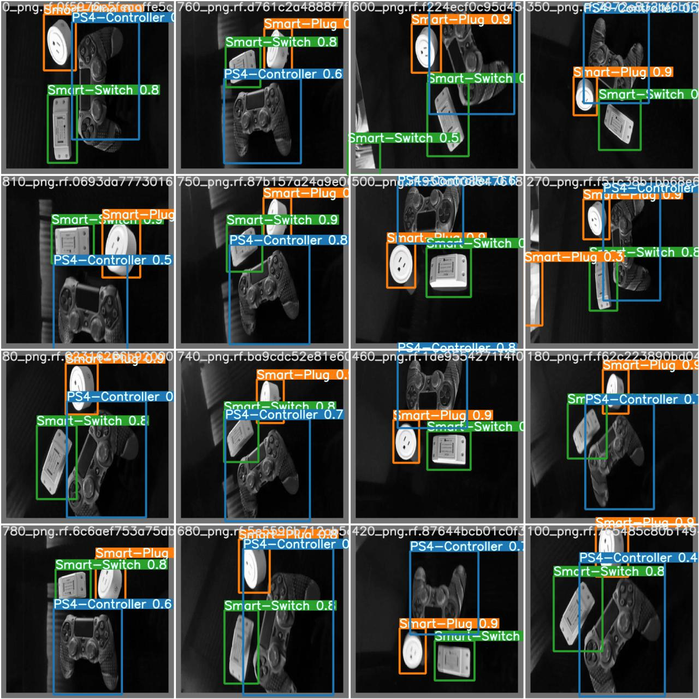

  <h3 >Argumented Data</h3>
  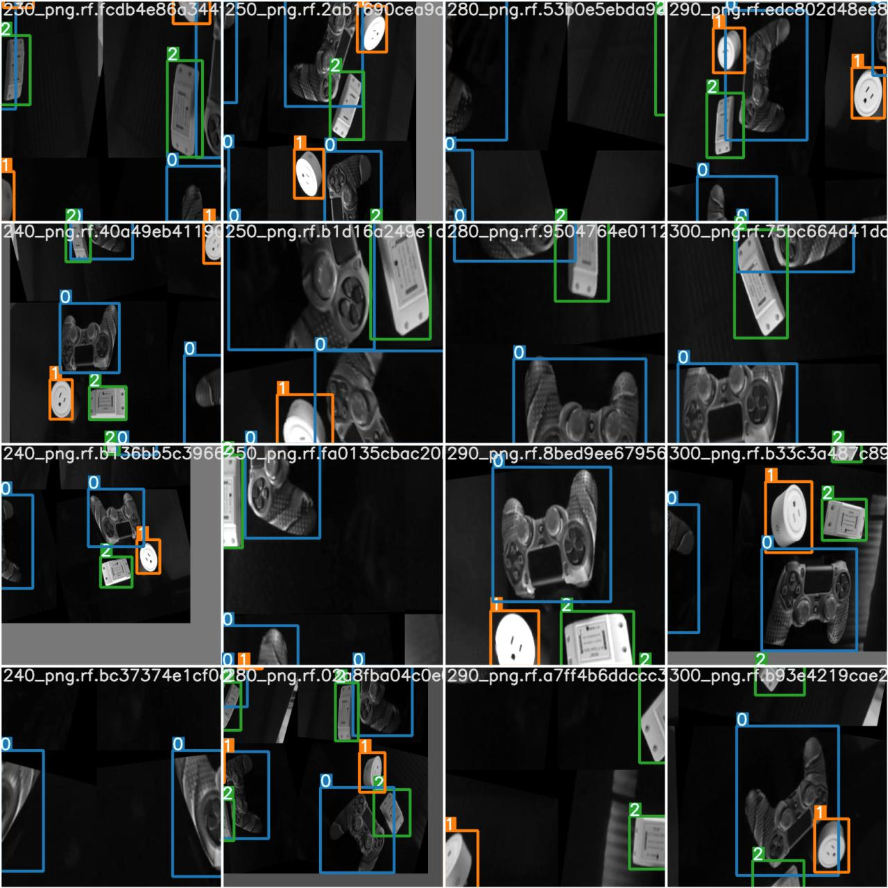

  <h3 >Confusion Matrix</h3>
  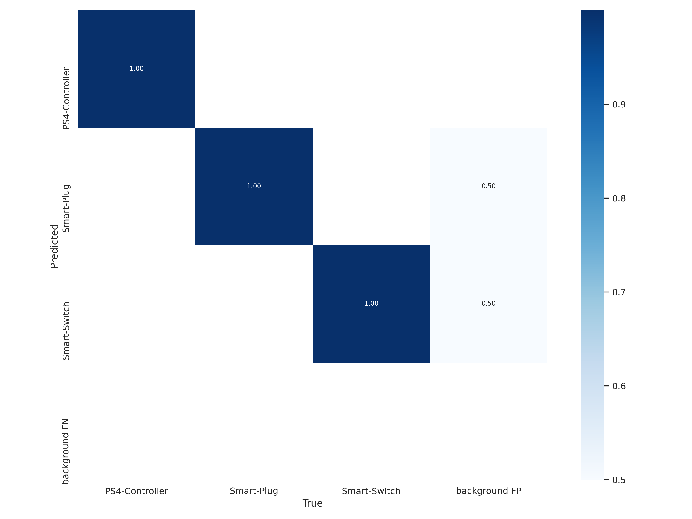

  <h3 >Results: </h3>
  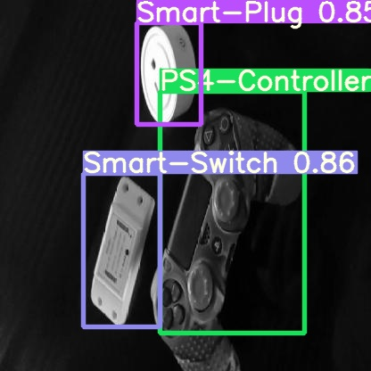
  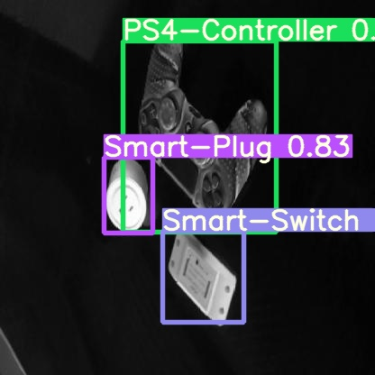
  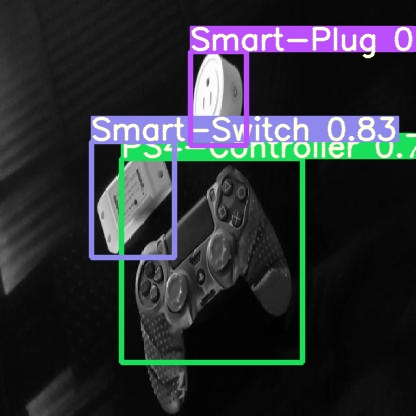

  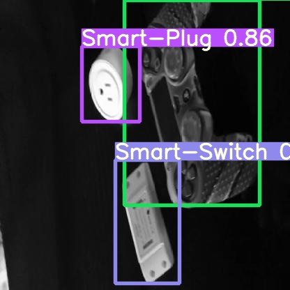
  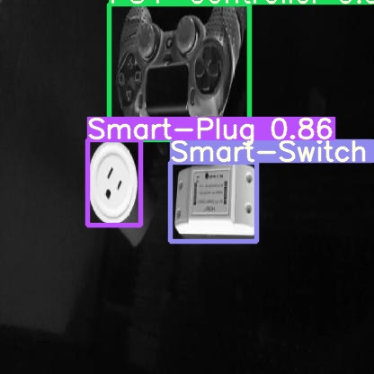
  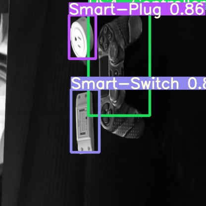

  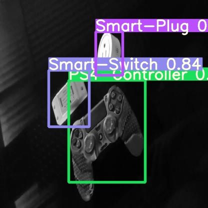
  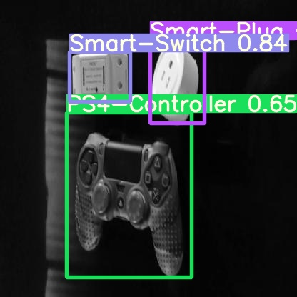
  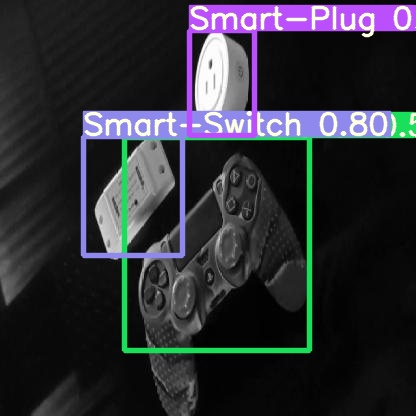

